# 🌟 Awesome Quality Management System (QMS) & eQMS Ecosystem

<p align="center">
  
</p>

<p align="center">
  <a href="https://github.com/ishandutta2007/Awesome-Awesome-Awesome"></a>
  <a href="https://discord.gg/jc4xtF58Ve"></a>
  <a href="https://github.com/ishandutta2007/Awesome-Quality-Management-System/stargazers"></a>
  <a href="https://github.com/ishandutta2007/Awesome-Quality-Management-System/network/members"></a>
  <a href="https://github.com/ishandutta2007/Awesome-Quality-Management-System/blob/main/LICENSE"></a>
  <a href="https://github.com/ishandutta2007/Awesome-Quality-Management-System/pulls"></a>
  <a href="https://github.com/ishandutta2007"></a>
</p>

---

## 🎯 Overview & Scope

A curated, comprehensive ecosystem guide to **Quality Management Systems (QMS)**, **electronic Quality Management Systems (eQMS)**, and regulatory compliance platforms. This index tracks leading enterprise **SaaS / Hosted Platforms** and open-source **GitHub Projects** designed for life sciences, biotechnology, medical devices (SaMD/AIaMD), aerospace, automotive, pharmaceuticals, healthcare, and advanced manufacturing.

These tools streamline and enforce:
- 📑 **Document Control & Controlled SOPs** (Version control, obsolescence, electronic signatures)
- ⚡ **CAPA & Nonconformance (NCMR)** (Root cause analysis, 8D, 5-Whys, containment, verification)
- 🔍 **Audit Management & Inspection Readiness** (Internal audits, supplier audits, FDA/ISO inspection logs)
- 🛡️ **Regulatory Compliance Frameworks** (ISO 9001, ISO 13485, FDA 21 CFR Part 11, FDA 21 CFR Part 820 / QMSR, GAMP 5, IATF 16949, AS9100, ISO 14971, IEC 62304)
- 🔄 **Change Control & Deviation Management** (Engineering change orders, process deviations, impact analysis)
- 👥 **Training & Competency Tracking** (Role-based training matrices, comprehension sign-offs)
- 🏭 **Supplier Quality Management (SQM)** (SCAR, scorecards, supplier qualification)
- 📊 **Statistical Process Control (SPC) & Quality Analytics** (FMEA, control charts, APQP/PPAP, KPI dashboards)

---

## 📚 Table of Contents

- [🏢 SaaS & Hosted QMS Platforms](#-saashosted-platforms)
- [💻 Open-Source GitHub Projects](#-open-source-github-projects)
- [🧩 Modular Self-Hosted QMS Architecture](#-modular-self-hosted-qms-architecture)
- [🤝 How to Contribute](#-how-to-contribute)
- [📈 Star History](#-star-history)
- [⚠️ Disclaimer](#-disclaimer)

---

## 🏢 SaaS/Hosted Platforms

> 📊 **Sector Market Size & Dynamics:** The global Quality Management System (QMS) software market is currently estimated at **$10.5B – $12.0B USD** and is projected to reach **$18.5B+ by 2030** growing at a CAGR of ~9.8%. The market is **moderately fragmented**, undergoing steady strategic consolidation led by diversified industrial giants (Honeywell, Hexagon, PTC, Fortive, Ideagen) while maintaining strong demand for domain-specialized niche SaaS suites (e.g., Greenlight Guru, Qualio). Because regulated verticals demand strict specialized compliance standards (MedTech ISO 13485/QMSR, Pharma GAMP 5/21 CFR Part 11, Aviation AS9100, Automotive IATF 16949), it operates as a multi-player specialist market rather than a winner-take-all landscape.

The table below summarizes leading SaaS QMS solutions, sorted descending by **Company Scale (Valuation / Revenue / Parent Market Cap)**:

| Platform | Company Scale (Valuation / Revenue / Parent Market Cap) | Description & Core Focus | Starting Tier Pricing | Free Tier / Free Trial Limits |
| :--- | :--- | :--- | :--- | :--- |
| **Sparta TrackWise** | **~$140B+ Parent Market Cap** (Honeywell) / ~$150M+ ARR | Enterprise quality-management platform for life sciences covering deviations, CAPA, complaints, audits, and change control. | Starting at ~$200/user/month (TrackWise Digital entry tier ~$24,000/year) | No free forever plan; 0-day self-serve trial (custom proof-of-value sandbox on request) |
| **Intelex QMS** | **~$26B+ Parent Market Cap** (Fortive) / Acquired for $570M | Enterprise EHSQ & quality management platform supporting quality events, CAPA, audits, document control, and training. | Starting at $49/user/month (Essentials plan, 25 users minimum = $1,225/month) | 14-day free trial access pass with pre-loaded compliance dashboards |
| **ETQ Reliance** | **~$25B+ Parent Market Cap** (Hexagon AB) / Acquired for $1.2B | Configurable enterprise quality management platform covering CAPA, nonconformance, audits, document control, risk, and analytics. | Starting at ~$25,000/year (CCU concurrent user licensing model) | No free forever plan; 0-day self-serve trial (custom proof-of-concept environment on request) |
| **Arena QMS** | **~$23B+ Parent Market Cap** (PTC Inc.) / Acquired for $715M | Cloud quality and product lifecycle platform combining QMS with product/BOM data, change management, and supplier quality. | Starting at ~$100/user/month (~$1,200/user/year, Launch tier) | No free forever plan; 14-day free trial / guided pilot available upon sales registration |
| **Ideagen Quality Management** | **~$1.38B (£1.09B) Valuation** / ~$200M+ ARR | Enterprise quality, audit, risk, and compliance management platform (formerly Q-Pulse) for aviation, healthcare, and manufacturing. | Starting at ~$19,500/year (~£15,720/year for base enterprise instance) | No free forever plan for full suite; 14-day free trial available for Ideagen Quality Control module |
| **MasterControl** | **$1.3B Valuation** (Privately held) / ~$150M+ ARR | Enterprise QMS platform for regulated life sciences & manufacturing covering document control, training, CAPA, and audit trails. | Starting at ~$25,000/year (~$2,083/month) for core starter edition | No free forever plan; 0-day self-serve trial (custom guided live sandbox demo on request) |
| **Greenlight Guru** | **$120M+ Growth Backing** (JMI Equity) / ~$40M–$50M ARR | Medical-device-focused QMS platform supporting design controls, document management, risk management (ISO 14971), and CAPA. | Starting at ~$200/user/month (annual starting baseline ~$25,000/year) | No free forever plan; 0-day self-serve trial for core QMS (14-day trial available for Clinical EDC module) |
| **Qualio** | **~$300M Valuation** ($65M+ raised) / ~$20M ARR | Cloud-first QMS for medical devices, pharmaceuticals, and biotech covering quality documentation, training, CAPA, and audits. | Starting at ~$12,000/year (~$1,000/month) for starter tier (up to 10 users) | No free forever plan; 0-day self-serve trial (custom sales-qualified sandbox walkthrough on request) |
| **AssurX** | **~$20M–$30M Annual Revenue** (Privately held) | Configurable quality and regulatory compliance management platform supporting CAPA, document control, audits, and complaints. | Starting at ~$18,000/year (~$1,500/month for cloud entry tier) | No free forever plan; 0-day self-serve trial (tailored live demo on request) |
| **Qualtrax** | **~$15M–$25M Annual Revenue** (Ideagen subsidiary) | Quality, compliance, document control, training, and automated workflow management platform for accredited testing labs and manufacturing. | Starting at ~$15,000/year (~$1,250/month base compliance bundle) | No free forever plan; 0-day self-serve trial (guided sandbox walkthrough on request) |
| **Intellect QMS** | **~$15M–$25M Annual Revenue** (Privately held) | Highly configurable no-code quality management software with AI tools for CAPA, audits, nonconformances, and document control. | Starting at ~$19,000/year (~$1,583/month for Pro starter edition) | No free forever plan; 14-day proof-of-concept sandbox access upon sales qualification |
| **QT9 QMS** | **~$10M–$20M Annual Revenue** (Privately held) | Manufacturing and life-sciences QMS covering document control, CAPA, nonconformance, audits, supplier management, and reporting. | Starting at ~$1,700/year (~$142/month for base concurrent user tier) | 30-day full-featured free trial with no credit card required |
| **Qualis** | **~$8M–$15M Annual Revenue** (Agaram Technologies) | Laboratory information and quality management software supporting ISO 17025/GxP document control, CAPA, and audits. | Starting at ~$8,300/year (~₹691,200/year for 5 users) | No free forever plan; 15-day evaluation trial upon request |
| **ETQ Dossier** | **Enterprise Business Unit** (ETQ / Hexagon) | Document-centric quality management software for controlled quality procedures, SOPs, and compliance records. | Starting at ~$18,000/year (~$1,500/month for document control module) | No free forever plan; 0-day self-serve trial (sales-assisted demo on request) |
| **Vivaldi QMS** | **~$5M–$10M Annual Revenue** (Bizzmine NV) | Quality and compliance process management system for ISO 9001/ISO 13485 audits, CAPA, and document management. | Starting at ~$289/month for small team starter deployment | 14-day full-access free trial with no credit card required |
| **FreeQMS** | **<$5M ARR** (Pharmatech Systems / Bootstrapped) | Cloud-native QMS built for medical devices, pharmaceuticals, and manufacturing quality operations. | Free forever for base modules; $10/user/month per paid module (CAPA, Audits, Complaints) | Free forever plan includes unlimited users, unlimited records, and unlimited storage for Suppliers, Customers, and Nonconformance modules |

---

## 💻 Open-Source GitHub Projects

Open-source quality management systems provide transparent, auditable, and self-hostable foundations for regulated organizations, startups, and agile manufacturers. 

The projects below are sorted descending by GitHub **Star Count**:

### 1. [GSTT-CSC/QMS-Template](https://github.com/GSTT-CSC/QMS-Template) [](https://github.com/GSTT-CSC/QMS-Template/stargazers)
- **Focus:** ISO 13485 Quality Management System for Medical Software (SaMD / AIaMD).
- **Description:** Developed by the Clinical Scientific Computing team at Guy’s and St Thomas’ NHS Foundation Trust. Provides battle-tested SOPs, templates, CAPA trackers, risk management matrices (ISO 14971), software lifecycle protocols (IEC 62304), and audit trails that have passed multiple real-world notified body audits.
- **License:** Open Documentation / NHS Template

### 2. [C-realize/OpenQMS](https://github.com/C-realize/OpenQMS) [](https://github.com/C-realize/OpenQMS/stargazers)
- **Focus:** Cloud-Native Open eQMS for Life Sciences & MedTech.
- **Description:** Lightweight, scalable quality management application built on modern web technologies. Enforces document approval hierarchies, 21 CFR Part 11 electronic signature requirements, audit logs, and compliance records.
- **License:** AGPL-3.0 / Dual-license

### 3. [jonaesantos/odoo-qms-iso9001](https://github.com/jonaesantos/odoo-qms-iso9001) [](https://github.com/jonaesantos/odoo-qms-iso9001/stargazers)
- **Focus:** Odoo ERP-Integrated ISO 9001 QMS Suite.
- **Description:** Full-featured open-source quality module for Odoo. Implements nonconformance management, corrective action workflows (8D/CAPA), internal audit tracking, calibration management, and customer complaint resolution directly within enterprise ERP data flows.
- **License:** LGPL-3.0

### 4. [MeyerThorsten/QAtrial](https://github.com/MeyerThorsten/QAtrial) [](https://github.com/MeyerThorsten/QAtrial/stargazers)
- **Focus:** AI-Powered Regulated eQMS & Clinical Quality Platform.
- **Description:** Modern, full-stack open-source quality management platform built with React, Prisma, and PostgreSQL. Covers electronic trial master files (eTMF), design controls, deviations, training management, supplier qualifications, electronic signatures, and GAMP/GxP compliance packs.
- **License:** MIT License

### 5. [Open-Industry-System/OpenQMS](https://github.com/Open-Industry-System/OpenQMS) [](https://github.com/Open-Industry-System/OpenQMS/stargazers)
- **Focus:** Manufacturing Quality Management & IATF 16949 Framework.
- **Description:** Full-stack industrial quality platform supporting FMEA, 8D/CAPA, control plans, Statistical Process Control (SPC), Measurement Systems Analysis (MSA), incoming inspection (IQC), supplier quality (SCAR), and APQP/PPAP workflows.
- **License:** MIT License

### 6. [AliakseiT/dearauditor-qms-baseline](https://github.com/AliakseiT/dearauditor-qms-baseline) [](https://github.com/AliakseiT/dearauditor-qms-baseline/stargazers)
- **Focus:** Git-Native Open eQMS Baseline for MedTech & AI Medical Devices.
- **Description:** Git-based QMS infrastructure providing complete baseline SOPs, clinical evaluation protocols, risk registers, and verification matrices mapped against ISO 9001, ISO 13485, ISO 14971, IEC 62304, IEC 62366-1, and ISO/IEC 27001.
- **License:** Open Baseline / MIT

### 7. [senrecep/qms](https://github.com/senrecep/qms) [](https://github.com/senrecep/qms/stargazers)
- **Focus:** .NET & Modern Web ISO 9001 Document Control & CAPA System.
- **Description:** Production-ready quality management web application emphasizing controlled document authoring, multi-level approval matrices, mandatory read confirmations, role-based security, and corrective-action tracking.
- **License:** MIT License

### 8. [jsimpsonn/MSP_QMS](https://github.com/jsimpsonn/MSP_QMS) [](https://github.com/jsimpsonn/MSP_QMS/stargazers)
- **Focus:** React / Next.js Manufacturing Quality & Audit Management.
- **Description:** Clean, modern web application built with Next.js, React, and Tailwind CSS designed for shop-floor quality tracking, internal audit scheduling, nonconformance logs, and corrective action item accountability.
- **License:** MIT License

### 9. [gerfru/qms-kit](https://github.com/gerfru/qms-kit) [](https://github.com/gerfru/qms-kit/stargazers)
- **Focus:** ISO 9001 Deployment Kit for XWiki, Atlassian & M365.
- **Description:** Scaffolding toolkit that generates structured quality documentation, audit checklists, management review schedules, and KPI dashboards for self-hosted wiki and collaboration environments.
- **License:** MIT License

### 10. [zavora-ai/mcp-qms](https://github.com/zavora-ai/mcp-qms) [](https://github.com/zavora-ai/mcp-qms/stargazers)
- **Focus:** Model Context Protocol (MCP) AI Quality Management Server.
- **Description:** AI-agent-centric quality integration server exposing standard MCP tools for batch release, supplier auditing, inspection results, nonconformances, CAPA investigations, and HACCP compliance.
- **License:** Apache-2.0

### 11. [laanito/tuqan](https://github.com/laanito/tuqan) [](https://github.com/laanito/tuqan/stargazers)
- **Focus:** Python-Based Quality Event & SCAR Management System.
- **Description:** Open-source platform handling customer complaints, supplier nonconformances (SCAR), internal audits, and root cause corrective actions with embedded trend analytics.
- **License:** GPL-3.0

### 12. [aebarth/nestbox](https://github.com/aebarth/nestbox) [](https://github.com/aebarth/nestbox/stargazers)
- **Focus:** Self-Hosted Regulated Record & Document Control System.
- **Description:** Document management system engineered specifically for FDA QMSR and ISO 13485 records with immutable audit trails, revision histories, and access controls.
- **License:** MIT License

### 13. [anishacini12/qms-capa-rca-assistant](https://github.com/anishacini12/qms-capa-rca-assistant) [](https://github.com/anishacini12/qms-capa-rca-assistant/stargazers)
- **Focus:** AI-Assisted Root Cause Analysis & CAPA Guidance Tool.
- **Description:** Specialized quality engineering utility providing guided 5-Whys and Ishikawa (Fishbone) root cause analysis for medical device quality investigations.
- **License:** MIT License

### 14. [kxsys/QMSCAPA](https://github.com/kxsys/QMSCAPA) [](https://github.com/kxsys/QMSCAPA/stargazers)
- **Focus:** Freeware / Open QMS & CAPA Module Suite.
- **Description:** Comprehensive desktop and networked quality management tool covering nonconformances, corrective actions, RMA tracking, supplier evaluations, risk assessments, and calibration logs.
- **License:** Freeware / Community Edition

---

## 🧩 Modular Self-Hosted QMS Architecture

For organizations building or deploying a self-hosted, vendor-neutral electronic quality management system, the industry-standard lifecycle flows through a unified modular pipeline:

```mermaid
flowchart LR
    A["📑 Document Control & SOPs"] --> B["⚡ Quality Events & Nonconformance"]
    B --> C["🔍 Investigation & Root Cause (RCA)"]
    C --> D["🛠️ CAPA & Change Control"]
    D --> E["🛡️ Risk Assessment (ISO 14971)"]
    E --> F["📋 Internal & External Audits"]
    F --> G["👥 Training & Competency Verification"]
    G --> H["🏭 Supplier Quality & SCAR"]
    H --> I["📊 Management Review & Analytics"]
```



### 🏗️ Recommended Open-Source Stack

```
   ┌────────────────────────────────────────────────────────┐
   │             User Interface & Portals                   │
   │   (Next.js / React / Vue + Tailwind + shadcn/ui)       │
   └──────────────────────────┬─────────────────────────────┘
                              │
   ┌──────────────────────────▼─────────────────────────────┐
   │          Authentication & Identity (21 CFR Part 11)    │
   │          (Keycloak / Authentik + MFA + SSO)            │
   └──────────────────────────┬─────────────────────────────┘
                              │
   ┌──────────────────────────▼─────────────────────────────┐
   │           Core QMS Backend & Workflow Engine           │
   │    (Node.js / FastAPI / Go / .NET + Temporal / Camunda)│
   └──────┬───────────────────┬───────────────────┬─────────┘
          │                   │                   │
   ┌──────▼──────┐     ┌──────▼──────┐     ┌──────▼─────────┐
   │ Relational  │     │   Object    │     │ Append-Only    │
   │ Data Store  │     │   Storage   │     │ Audit Trail    │
   │(PostgreSQL) │     │   (MinIO)   │     │  (EventStore)  │
   └─────────────┘     └─────────────┘     └────────────────┘
```

---

## 🤝 How to Contribute

Contributions from quality professionals, regulatory affairs specialists, software engineers, and compliance auditors are welcome!

1. 🍴 **Fork the repository**
2. 🌿 **Create a feature branch:** `git checkout -b add-new-qms-tool`
3. 📝 **Add/Update entries:**
   - For **SaaS platforms:** Include company scale (valuation/revenue), specific starting tier pricing, and precise free tier/trial limits.
   - For **Open-source projects:** Include repository link, star badge, primary focus, and license.
4. 🚀 **Submit a Pull Request** with a clear explanation of your additions.

---

## 📈 Star History

[](https://star-history.dera.page/#ishandutta2007/Awesome-Quality-Management-System&type=date&legend=top-left)

---

## ⚠️ Disclaimer

This repository is a community-curated educational index and does not constitute regulatory or legal advice. Implementing an open-source or commercial QMS does not automatically guarantee ISO, FDA, or GxP compliance. Regulated organizations must validate computer systems (CSV/CSA), define standard operating procedures (SOPs), enforce data integrity (ALCOA+), and ensure regulatory alignment for their specific intended use.
